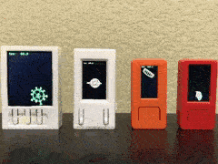

# stevesch-Mesh

This library provides 3D mesh representation for wireframe objects, as well as the ability to load OBJ files into the internal format.  Full 3D transformations are provided (local-to-world, world-to-view, etc.), allowing 3D animation and motion to be rendered using, for instance, the stevesch-Display library.

The library is primarily targeted at the ESP32 microcontroller, for use with small TFT displays.

The above demo renderer is available in the examples/minimal folder of the workspace.
# Building and Running

For a basic example, clone this repo and open the folder in PlatformIO.

The PlatformIO Project Tasks contains build configurations for various boards (TTGO T-Display, M5StickC, generic ESP32 devkit board, etc.).

Attach your board via a serial port, then select "Upload" under the section for your board in the Project Tasks.  This will build the example project, upload it to your board, and start it running.

Run the "Upload Filesystem Image" to copy the 3D model files from the "data" folder in the minimal example project to the SPIFFS file system on your device (this is the built-in flash storage on the ESP32).
